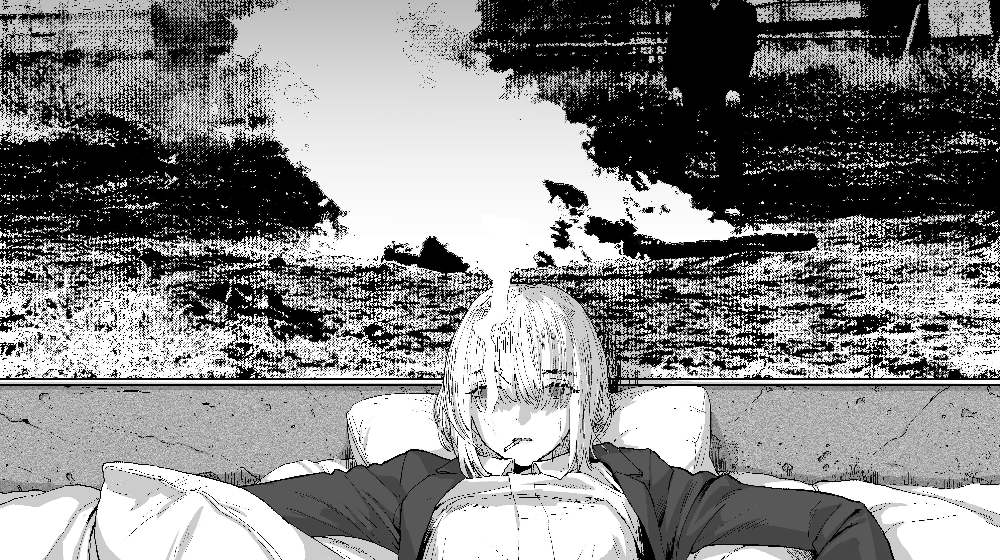

  

   
   

 

  

    <samp>
      "Janganlah pernah menyerah ketika kamu masih mampu berusaha lagi.
       
      <b> Tidak ada kata berakhir sampai kamu berhenti mencoba."</b>
    </samp>
  

   

  
  
  

 

---

###  About Me

> <samp>Saya adalah mahasiswa Teknik Informatika yang tertarik pada **Web Development** dan **Android Modding**.</samp>

- 🔭 I’m currently working on **Coffee Shop Website**
- 🌱 I’m currently learning **Python (Django) & English**
- 📱 I love **Android Custom ROMs & Rooting**
- ⚡ Fun fact: **"A corpse is talking."**

---

###  Tech Stack

  
  
  
  
  
  
  
  
  

 

  <samp>If you work for me, I’ll grant you any wish.   <b>Bang.</b> 👉💥</samp>
    
  

